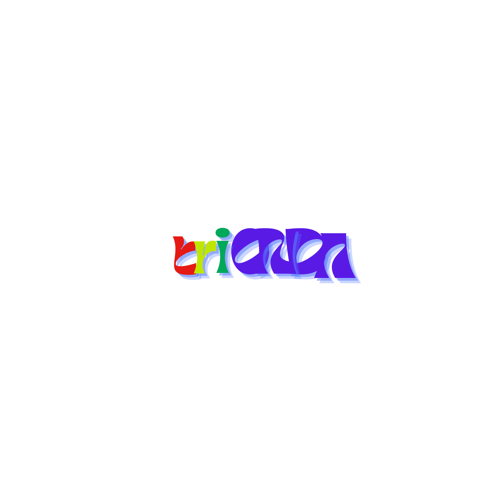

<div align="center">



# TRIONDA

### Machine-Learning Match Predictor for the 2026 FIFA World Cup

A full-stack prediction engine — from raw data to a polished interactive UI —
that forecasts the **winner**, the **scoreline** and the **goalscorers**
for every match of the 2026 FIFA World Cup.

<br/>


<br/>

**[🟢 Live demo → daudibrahimhasan.github.io/triONDA](https://daudibrahimhasan.github.io/triONDA/)**

</div>

---

<div align="center">


</div>

---

## 🏗️ Architecture at a glance

```
                  ┌─────────────────────────────────────────────────┐
                  │                 Data Layer                      │
                  │  results.csv · FIFA rankings · FC26 ratings     │
                  │  2026 squads · 2026 fixtures & venues           │
                  └────────────────────┬────────────────────────────┘
                                       │
                  ┌────────────────────▼────────────────────────────┐
                  │           Feature Pipeline (140+ features)      │
                  │  Elo · FIFA rank · form · H2H · style · squad   │
                  │  situational · intel · club form                │
                  │  ↓ all point-in-time — zero leakage ↓          │
                  └────────────────────┬────────────────────────────┘
                                       │
              ┌────────────────────────▼────────────────────────────┐
              │              Five Sub-Models                        │
              │  Form · Style · H2H · Squad · Neural (Keras)       │
              └────────────────────────┬────────────────────────────┘
                                       │
              ┌────────────────────────▼────────────────────────────┐
              │   Elo-Anchored XGBoost Stacking Ensemble            │
              │   + Dixon-Coles Scoreline Model                     │
              │   + Real-Squad Goalscorer Model                     │
              └────────────────────────┬────────────────────────────┘
                                       │
              ┌────────────────────────▼────────────────────────────┐
              │               Frontend (React + Vite)               │
              │  Bracket · Awards · About · Run-a-Prediction        │
              │  → deployed to GitHub Pages                         │
              └─────────────────────────────────────────────────────┘
```

---

## ✨ What TRIONDA predicts

For any fixture — say `Brazil vs Morocco` — the system produces:

| Output | Description |
|---|---|
| 🏆 **Winner** | Home win / Draw / Away win probabilities with honest confidence scores |
| ⚽ **Scoreline** | The most-likely scoreline (+ alternatives) from a Dixon-Coles Poisson model |
| 👟 **Goalscorers** | Top likely goalscorers per side, drawn from each nation's **real 2026 squad** |
| 🎲 **Chaos coefficient** | A transparency metric — low-confidence matches are labelled honestly |

Every prediction ships with a calibrated **confidence score** and a **chaos coefficient** —
the system deliberately widens uncertainty on volatile matchups rather than faking certainty.

---

## 🧠 The ML pipeline

### Data sources

| Source | What it provides |
|---|---|
| `results.csv` | ~49 000 international results, 1872 → 2024 (martj42) |
| `goalscorers.csv` | Historical match-level goalscorer records |
| `fifa_ranking-2026-04-01.csv` | Monthly FIFA rankings, 1993 → 2026 |
| `FC26_20250921.csv` | EA FC 26 player ratings (finishing, overall, pace, etc.) |
| `wc2026_squads.csv` | Official 2026 squad lists for all 48 nations |
| `fixture_venue/` | Official 2026 schedule: 105 matches, 48 teams, 16 venues |

### Feature engineering — 140+ features, zero leakage

The pipeline (`features/build_features.py`) walks every historical match **once in chronological order**,
building per-team and per-pair features incrementally — so every feature is strictly point-in-time.

| Family | Key signals |
|---|---|
| `rating_*` | Incremental Elo (K=30, +65 home advantage), point-in-time FIFA rank & points |
| `form_*` | Recent results, win streaks, goals for/against over sliding windows |
| `h2h_*` | Head-to-head win rate, goal difference, historical dominance |
| `style_*` | Tactical proxies derived from scoring patterns (attack vs defence balance) |
| `squad_*` | Squad quality from FC26 attributes, weighted by position |
| `sit_*` | Situational context: tournament stage, home/neutral, rest days, travel |
| `intel_*` | Chaos coefficient, competitive-balance signals |

### Five sub-models → Stacking ensemble

Each sub-model predicts a W/D/L probability vector:

1. **Form model** — Gradient boosting over recent-form features
2. **Style model** — Tactical-proxy features
3. **H2H model** — Head-to-head history
4. **Squad model** — Random Forest over squad-quality features
5. **Neural model** — Keras feed-forward net over all feature columns

These feed into an **Elo-anchored XGBoost meta-learner** trained on
**time-aware out-of-fold** predictions (`TimeSeriesSplit`), with raw Elo/rank
priors injected directly into the stacker to preserve the strongest signal.

### Dixon-Coles score model

A Maher/Dixon-Coles independent-Poisson model with low-score (`ρ`) correction.
Attack/defence/home-advantage strengths estimated via recency-weighted
(540-day half-life) fixed-point iteration. Returns expected goals, the full
scoreline matrix, and the most-likely scorelines.

### Real-squad goalscorer model

Ranks each nation's players by: `position weight × finishing`, where finishing
blends FC26 attributes with real goals-per-appearance (last 4 years) and
goals-per-cap. Pulls from official squad CSV → live API fallback → FC26 last resort.

---

## 📊 Accuracy — honest

Validation trains on matches before 2022-01-01 and tests on **147 tournament matches**
(World Cup 2022 + Euro 2024 + Copa América 2024).

| Model | 3-way accuracy | Log-loss |
|---|---:|---:|
| Raw Elo favourite (baseline) | ~53.7% | — |
| Elo-anchored stacking ensemble | ~51.7% | ~0.995 |
| Dixon-Coles score model | ~48.3% | — |

> **Why these numbers are good:** 3-way international football has a practical accuracy
> ceiling of ~50–54%. Roughly a quarter of matches are draws, outcomes are low-scoring,
> and even bookmakers land in a similar band. The ensemble trades a small amount of raw
> accuracy for better-calibrated, honest probabilities — it keeps draw mass and widens
> uncertainty on chaotic matches rather than faking confidence.

---

## 🖥️ The frontend

The frontend is a zero-backend, client-rendered **React 18 + TypeScript** app built with **Vite**.
It loads a single pre-computed `data.json` (exported from the Python pipeline) and renders it
as an interactive, colour-coded experience.

| Panel | What you see |
|---|---|
| 🟣 **Bracket** | Full knockout tree, R32 → Final, with the predicted champion |
| 🔴 **About** | How the model works — features, sub-models, blind validation |
| 🟡 **Awards** | Simulated tournament awards (Golden Boot, Golden Ball, etc.) |
| 🟢 **Run** | Pick any two teams and get live W/D/L + scoreline + goalscorers |

### Design system

Built from the four official World Cup 2026 brand stripes:

| | Colour | Hex | Role |
|---|---|---|---|
| 🟣 | Violet | `#5A1AE6` | Bracket, primary accents |
| 🔴 | Red | `#E51A14` | About panel, lock / warning states |
| 🟡 | Lime | `#BFE600` | Awards, score highlights |
| 🟢 | WC Green | `#00A85A` | Run panel, success states |

Typography: **Unbounded** (display) · **Inter** (body) · **JetBrains Mono** (numbers & labels)

---

## ⚡ Live data & real-time updates

| Module | What it does |
|---|---|
| `live/api_football.py` | Cache-first API-Football (v3 free tier, 100 req/day) — fixtures, lineups, injuries, squads. Never crashes: falls back to stale cache or empty result |
| `live/squads.py` | Resolves official squads for teams missing from the CSV |
| `live/odds_api.py` | Pulls bookmaker odds for benchmarking |
| `live/lineup_adjust.py` | Adjusts predictions when confirmed lineups arrive |
| `update.py` | Match-day rules: lineup confirmation at T-24h, injuries/weather at T-3h, key-player-out penalty, prediction lock at T-1h |

---

## 📂 What's in this repo

> **This repository contains the frontend and the pre-computed prediction results only.**
> The full ML pipeline, training code, feature engineering, and model source code are **not included** in this public release.

What you'll find here:

- `src/` — React + TypeScript frontend source code
- `public/data.json` — Pre-computed predictions exported from the ML pipeline
- `docs/` — Screenshots and branding assets

---

## 🚀 Getting started

```bash
# Install (Node 20+)
npm install

# Dev server with HMR
npm run dev

# Production build → dist/
npm run build
```

---

## 📦 Deployment

Pushing to `main` triggers a GitHub Actions workflow that builds the frontend
and publishes `dist/` to **GitHub Pages** — no manual steps required.

---

## 📬 Contact

Interested in the full model, the training pipeline, or a collaboration?
Feel free to reach out:

<div align="center">

**[@daudibrahimhasan](https://github.com/daudibrahimhasan)** on GitHub

</div>

---

<div align="center">


**© 2026 TRIONDA** · Built by [@daudibrahimhasan](https://github.com/daudibrahimhasan)

</div>
